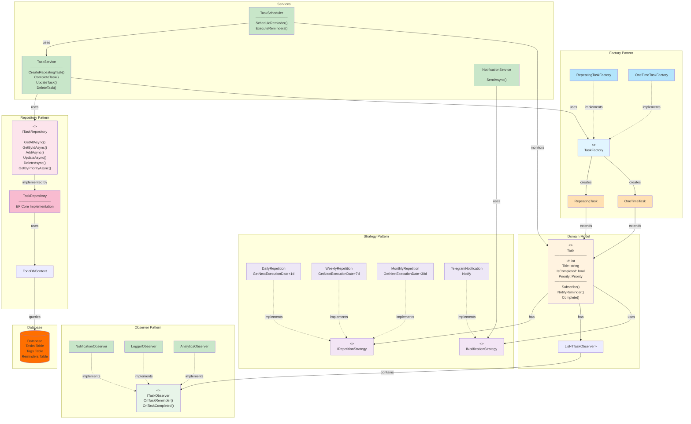

# UML-Diagram

```mermaid
flowchart TB
 subgraph subGraph0["Factory Pattern"]
        TaskFactory["&lt;&gt;<br>TaskFactory"]
        RepeatingTaskFactory["RepeatingTaskFactory"]
        OneTimeTaskFactory["OneTimeTaskFactory"]
        RepeatingTask["RepeatingTask"]
        OneTimeTask["OneTimeTask"]
  end
 subgraph subGraph1["Strategy Pattern"]
        IRepetition["&lt;&gt;<br>IRepetitionStrategy"]
        IDailyRepetition["DailyRepetition<br>GetNextExecutionDate+1d"]
        IWeeklyRepetition["WeeklyRepetition<br>GetNextExecutionDate+7d"]
        IMonthlyRepetition["MonthlyRepetition<br>GetNextExecutionDate+30d"]
        INotification["&lt;&gt;<br>INotificationStrategy"]
        SMSNotif["TelegramNotification<br>Notify"]
  end
 subgraph subGraph2["Observer Pattern"]
        ITaskObserver["&lt;&gt;<br>ITaskObserver<br>OnTaskReminder()<br>OnTaskCompleted()"]
        NotifObserver["NotificationObserver"]
        LoggerObserver["LoggerObserver"]
        AnalyticsObserver["AnalyticsObserver"]
  end
 subgraph subGraph3["Domain Model"]
        BaseTask["&lt;&gt;<br>Task<br>─────────────<br>Id: int<br>Title: string<br>IsCompleted: bool<br>Priority: Priority<br>─────────────<br>Subscribe()<br>NotifyReminder()<br>Complete()"]
        List["List&lt;ITaskObserver&gt;"]
  end
 subgraph subGraph4["Repository Pattern"]
        ITaskRepository["&lt;&gt;<br>ITaskRepository<br>─────────────<br>GetAllAsync()<br>GetByIdAsync()<br>AddAsync()<br>UpdateAsync()<br>DeleteAsync()<br>GetByPriorityAsync()"]
        TaskRepository["TaskRepository<br>─────────────<br>EF Core Implementation"]
        DbContext["TodoDbContext"]
  end
 subgraph Database["Database"]
        DB[("Database<br>Tasks Table<br>Tags Table<br>Reminders Table")]
  end
 subgraph Services["Services"]
        TaskService["TaskService<br>─────────────<br>CreateRepeatingTask()<br>CompleteTask()<br>UpdateTask()<br>DeleteTask()"]
        NotificationService["NotificationService<br>─────────────<br>SendAsync()"]
        TaskScheduler["TaskScheduler<br>─────────────<br>ScheduleReminder()<br>ExecuteReminders()"]
  end
    TaskFactory -- creates --> RepeatingTask & OneTimeTask
    RepeatingTaskFactory -. implements .-> TaskFactory
    OneTimeTaskFactory -. implements .-> TaskFactory
    IDailyRepetition -. implements .-> IRepetition
    IWeeklyRepetition -. implements .-> IRepetition
    IMonthlyRepetition -. implements .-> IRepetition
    SMSNotif -. implements .-> INotification
    NotifObserver -. implements .-> ITaskObserver
    LoggerObserver -. implements .-> ITaskObserver
    AnalyticsObserver -. implements .-> ITaskObserver
    RepeatingTask -- extends --> BaseTask
    OneTimeTask -- extends --> BaseTask
    BaseTask -- has --> IRepetition & List
    List -- contains --> ITaskObserver
    ITaskRepository -- implemented by --> TaskRepository
    TaskRepository -- uses --> DbContext
    DbContext -- queries --> DB
    BaseTask -- uses --> INotification
    TaskService -- uses --> ITaskRepository & TaskFactory
    NotificationService -- uses --> INotification
    TaskScheduler -- uses --> TaskService
    TaskScheduler -- monitors --> BaseTask

    style TaskFactory fill:#e1f5ff
    style RepeatingTaskFactory fill:#b3e5fc
    style OneTimeTaskFactory fill:#b3e5fc
    style RepeatingTask fill:#ffe0b2
    style OneTimeTask fill:#ffe0b2
    style IRepetition fill:#f3e5f5
    style IDailyRepetition fill:#ede7f6
    style IWeeklyRepetition fill:#ede7f6
    style IMonthlyRepetition fill:#ede7f6
    style INotification fill:#f3e5f5
    style SMSNotif fill:#ede7f6
    style ITaskObserver fill:#e8f5e9
    style NotifObserver fill:#c8e6c9
    style LoggerObserver fill:#c8e6c9
    style AnalyticsObserver fill:#c8e6c9
    style BaseTask fill:#fff3e0
    style ITaskRepository fill:#fce4ec
    style TaskRepository fill:#f8bbd0
    style DB fill:#ff6f00
    style TaskService fill:#c8e6c9
    style NotificationService fill:#c8e6c9
    style TaskScheduler fill:#c8e6c9
```
