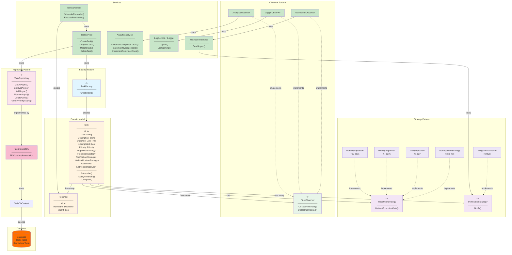

# UML-Diagram

```mermaid
flowchart TB
 subgraph Factory["Factory Pattern"]
        TaskFactory["<> <br> TaskFactory <br> ───────────── <br> CreateTask()"]
  end

 subgraph Strategy["Strategy Pattern"]
        IRepetition["<> <br> IRepetitionStrategy <br> ───────────── <br> GetNextExecutionDate()"]
        NoRepetition["NoRepetitionStrategy <br> return null"]
        DailyRepetition["DailyRepetition <br> +1 day"]
        WeeklyRepetition["WeeklyRepetition <br> +7 days"]
        MonthlyRepetition["MonthlyRepetition <br> +30 days"]

        INotification["<> <br> INotificationStrategy <br> ───────────── <br> Notify()"]
        TelegramNotif["TelegramNotification <br> Notify()"]
  end

 subgraph Observer["Observer Pattern"]
        ITaskObserver["<> <br> ITaskObserver <br> ───────────── <br> OnTaskReminder() <br> OnTaskCompleted()"]
        NotifObserver["NotificationObserver"]
        LoggerObserver["LoggerObserver"]
        AnalyticsObserver["AnalyticsObserver"]
  end

 subgraph Domain["Domain Model"]
        Task["Task <br> ───────────── <br> Id: int <br> Title: string <br> Description: string <br> DueDate: DateTime <br> IsCompleted: bool <br> Priority: Priority <br> RepetitionStrategy: IRepetitionStrategy <br> NotificationStrategies: List&lt;INotificationStrategy&gt; <br> Observers: List&lt;ITaskObserver&gt; <br> ───────────── <br> Subscribe() <br> NotifyReminder() <br> Complete()"]
        Reminder["Reminder <br> ───────────── <br> Id: int <br> RemindAt: DateTime <br> IsSent: bool"]
  end

 subgraph Repository["Repository Pattern"]
        ITaskRepository["<> <br> ITaskRepository <br> ───────────── <br> GetAllAsync() <br> GetByIdAsync() <br> AddAsync() <br> UpdateAsync() <br> DeleteAsync() <br> GetByPriorityAsync()"]
        TaskRepository["TaskRepository <br> ───────────── <br> EF Core Implementation"]
        DbContext["TodoDbContext"]
  end

 subgraph Services["Services"]
        TaskService["TaskService <br> ───────────── <br> CreateTask() <br> CompleteTask() <br> UpdateTask() <br> DeleteTask()"]
        NotificationService["NotificationService <br> ───────────── <br> SendAsync()"]
        AnalyticsService["AnalyticsService <br> ───────────── <br> IncrementCompletedTasks() <br> IncrementOverdueTasks() <br> IncrementReminderCount()"]
        LogService["ILogService / ILogger <br> ───────────── <br> LogInfo() <br> LogWarning()"]
        TaskScheduler["TaskScheduler <br> ───────────── <br> ScheduleReminder() <br> ExecuteReminders()"]
  end

 subgraph Database["Database"]
        DB[("Database <br> Tasks Table <br> Reminders Table")]
  end

    NoRepetition -. implements .-> IRepetition
    DailyRepetition -. implements .-> IRepetition
    WeeklyRepetition -. implements .-> IRepetition
    MonthlyRepetition -. implements .-> IRepetition

    TelegramNotif -. implements .-> INotification

    NotifObserver -. implements .-> ITaskObserver
    LoggerObserver -. implements .-> ITaskObserver
    AnalyticsObserver -. implements .-> ITaskObserver

    Task -- has --> IRepetition
    Task -- has many --> INotification
    Task -- has many --> ITaskObserver
    Task -- has many --> Reminder

    TaskFactory -- creates --> Task

    ITaskRepository -- implemented by --> TaskRepository
    TaskRepository -- uses --> DbContext
    DbContext -- queries --> DB

    TaskService -- uses --> ITaskRepository
    TaskService -- uses --> TaskFactory

    NotificationService -- uses --> INotification
    TaskScheduler -- uses --> TaskService
    TaskScheduler -- checks --> Reminder

    NotifObserver -- uses --> NotificationService
    LoggerObserver -- uses --> LogService
    AnalyticsObserver -- uses --> AnalyticsService

    style TaskFactory fill:#e1f5ff
    style IRepetition fill:#f3e5f5
    style NoRepetition fill:#ede7f6
    style DailyRepetition fill:#ede7f6
    style WeeklyRepetition fill:#ede7f6
    style MonthlyRepetition fill:#ede7f6
    style INotification fill:#f3e5f5
    style TelegramNotif fill:#ede7f6
    style ITaskObserver fill:#e8f5e9
    style NotifObserver fill:#c8e6c9
    style LoggerObserver fill:#c8e6c9
    style AnalyticsObserver fill:#c8e6c9
    style Task fill:#fff3e0
    style Reminder fill:#fff3e0
    style ITaskRepository fill:#fce4ec
    style TaskRepository fill:#f8bbd0
    style DB fill:#ff6f00
    style TaskService fill:#c8e6c9
    style NotificationService fill:#c8e6c9
    style AnalyticsService fill:#c8e6c9
    style LogService fill:#c8e6c9
    style TaskScheduler fill:#c8e6c9
```
